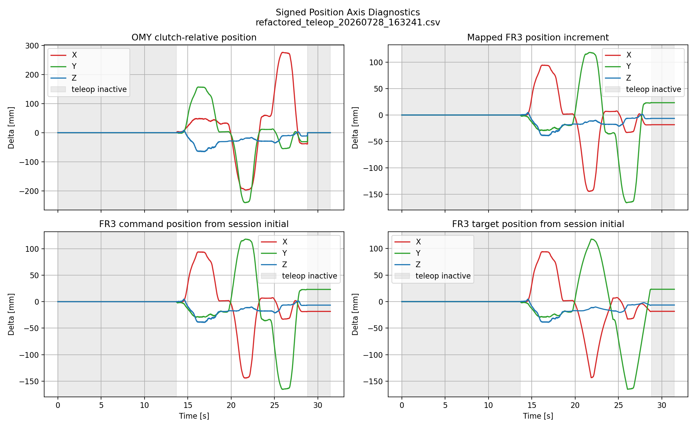
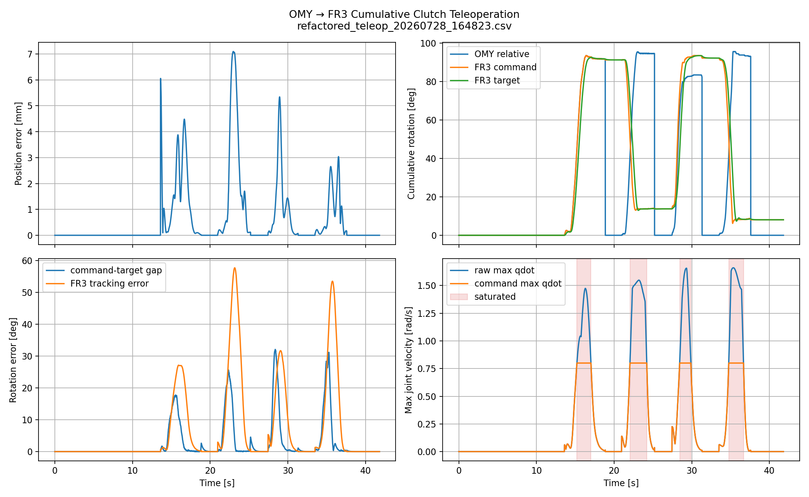
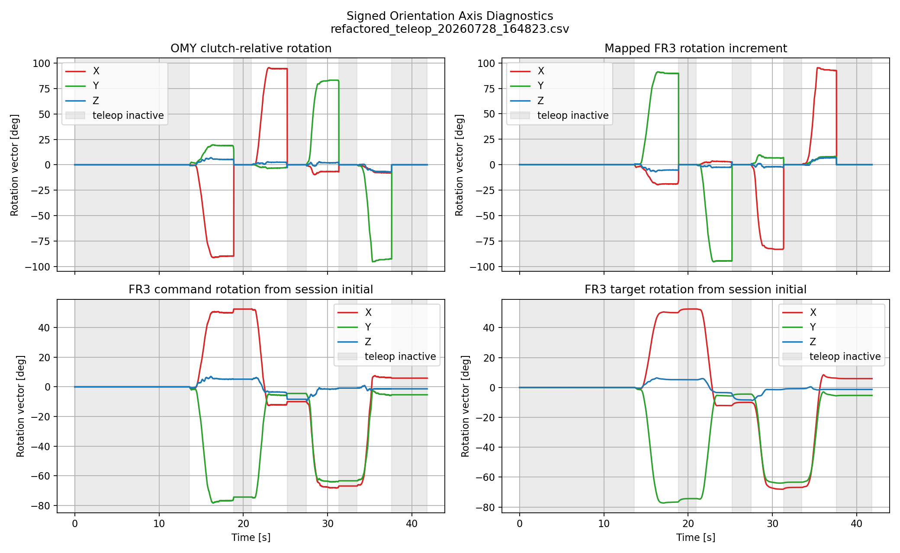
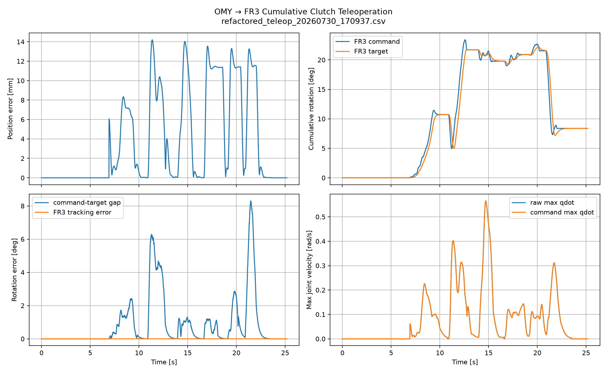

# OMY–FR3 Position 및 Full-Pose 텔레오퍼레이션 디버깅

> Milestone 1: MuJoCo 단방향 Cartesian 텔레오퍼레이션 안정화

## 1. 문서 개요

이 문서는 OMY-L100 leader의 Cartesian motion을 MuJoCo FR3 follower에
전달하는 단방향 teleoperation을 `position_only`에서 `full_pose` 6D DLS까지
안정화한 과정의 기록임.

주요 내용은 runtime pose anchor, axis mapping, clutch continuity, velocity IK,
command-target separation, stopping-distance conditioning, full-pose DLS 및
null-space posture debugging임.

joystick, passive gravity compensation, precision/contact/haptic, real FR3 및
dataset pipeline은 별도 문서와 작업 범위임.

## 2. 최종 구현 상태

지원 mode는 `position_only`, `orientation_only`, `full_pose` 세 가지다.
`full_pose`에서는 position/rotational Jacobian을 결합한 6×7 task Jacobian과
damped least-squares velocity IK로 7개 joint의 `qdot`을 계산함.

```text
OMY /leader/joint_states
  → OMY MuJoCo FK
  → runtime clutch anchor와 relative command
  → position/orientation mapping
  → linear/angular target conditioning
  → 6D task DLS velocity IK
  → qdot * dt
  → FR3 MuJoCo actuator command
```

MuJoCo free-space에서 position 방향성, 제한된 orientation 축/부호, mode별
hold, cumulative clutch, logical command와 rate-limited target 분리를
확인함. 모든 workspace, 빠른 동작, 정량 benchmark, real FR3 safety가
완료된 것은 아님.

## 3. 디버깅 요약

| 문제 | 핵심 판단 및 수정 | 상태 |
|---|---|---|
| [초기 자세 기준 오류](#runtime-initial-pose-error) | runtime pose를 Trigger anchor로 사용 | 테스트 MuJoCo에서 확인 |
| [Position axis mapping 오류](#position-axis-mapping-error) | `POSITION_AXIS_MAP` 분리 및 one-axis test | 테스트 방향에서 확인 |
| [Trigger 전환과 position-only IK 불안정](#trigger-position-ik-instability) | command reference와 velocity IK 사용 | 테스트 run에서 개선 |
| [Clutch anchor 연속성](#clutch-anchor-continuity) | logical command를 다음 anchor로 사용 | 테스트 run에서 확인 |
| [`MAX_DQ`의 주파수 의존성](#per-cycle-dq-velocity-ik) | `qdot`를 rad/s로 제한하고 `qdot*dt` 적분 | 구현 완료 |
| [Mode 혼합과 axis 진단 부족](#mode-signed-axis-diagnostics) | 세 mode와 signed XYZ/rotvec log 추가 | 부분 검증 |
| [Command-target coupling](#command-conditioned-target-separation) | command와 conditioned target 상태 분리 | 테스트 run에서 확인 |
| [Goal 근처 overshoot](#stopping-distance-braking) | stopping-distance 기반 감속 | 테스트 설정에서 지속 진동 미재현 |
| [Full-pose DLS saturation/scale](#full-pose-dls-scale-tuning) | 6D DLS와 raw/commanded `qdot` 분리 | 부분 검증 |
| [Null-space posture](#null-space-posture) | 7DoF redundancy에 optional posture objective 구현 | 구현 완료, 효과 미정량 검증 |

## 4. 상세 디버깅 기록

<a id="runtime-initial-pose-error"></a>
### 4.1 Runtime initial pose 오류

#### 관찰 현상

XML home과 runtime FK pose를 같은 초기값으로 취급하면 Trigger ON 직후
relative delta가 0이 아니거나 target jump가 발생했음.

#### 원인 후보

- XML home과 실제 ROS joint state 불일치
- MuJoCo FK 전후의 pose 사용 시점 차이
- follower actual pose를 logical command 기준으로 사용

#### 진단

매 stroke의 기준은 XML reference가 아니라 Trigger rising edge에서 읽은
runtime OMY pose와 현재 FR3 logical command여야 함.

#### 수정 내용

`omy_current_position/rotation`을 `omy_anchor_position/rotation`으로,
`fr3_command_position/rotation`을 FR3 anchor로 캡처함. 이후
`make_desired_target()`는 이 runtime anchor 기준 relative target을 만듦.

#### 검증 근거

Trigger ON에서 relative pose continuity와 command anchor angle을 출력하고,
signed plot으로 초기 jump와 axis sign을 분리해 확인함.

#### 결정

XML home은 초기화/reference로만 사용함. real FR3 초기화와 safety는 이
문서에서 판단하지 않는다.

<a id="position-axis-mapping-error"></a>
### 4.2 Position axis mapping 오류

#### 관찰 현상

OMY forward/lateral/up-down 조작이 FR3의 같은 이름 축으로 직접 나타나지
않았고, lateral motion은 축 교환과 부호를 함께 확인해야 했음.

#### 원인 후보

- OMY와 FR3 frame convention 차이
- EE position delta의 축 교환/부호 오류
- position과 orientation mapping의 상수 공유

#### 진단

position-only에서 한 방향씩 움직이며 signed raw delta와 mapped delta를
비교했음. 테스트된 mapping은 `FR3 X = OMY Y`, `FR3 Y = -OMY X`,
`FR3 Z = OMY Z`에 해당하는 `current_90` 후보다.

#### 수정 내용

`POSITION_AXIS_MAP`과 `ORIENTATION_AXIS_MAP`을 독립적으로 두고 자동 선택을
하지 않았음. position-only에서는 position mapping만 command에 반영함.

#### 검증 근거



*Position-only signed-axis debugging result.*

#### 결정

테스트한 position 방향에는 현재 mapping을 사용함. 이를 orientation mapping
전체의 근거로 확장하지 않음.

<a id="trigger-position-ik-instability"></a>
### 4.3 Trigger 전환과 position-only IK 불안정

#### 관찰 현상

Trigger 전환에서 FR3가 내려가거나 흔들렸다. target, IK command, simulator
actual q 중 어느 상태가 원인인지 초기 로그만으로 분리하기 어려웠음.

#### 원인 후보

actual q와 actuator command 혼용, Jacobian index, DLS conditioning,
per-cycle `dq`, target velocity reset을 검토했음.

#### 진단

보수적인 DLS와 per-cycle limit은 중간 안정화 단계였다. qdot,
commanded qdot, joint saturation, task residual을 분리해야 최종 구조의
동작을 해석할 수 있었다.

#### 수정 내용

held actuator command를 integration reference로 사용하고, velocity DLS
결과를 joint speed limit에 통과시켜 `qdot * dt`로 갱신함. target도
command와 분리했음.

#### 검증 근거



*Velocity-based IK diagnostic summary.*

#### 결정

position-only 초기 불안정의 단일 원인은 확정하지 않음. 현재 baseline은
velocity IK이며 Python loop가 hard real-time이라는 뜻은 아님.

<a id="clutch-anchor-continuity"></a>
### 4.4 Clutch anchor 연속성

#### 관찰 현상

Trigger 재입력 시 이전 command와 새 OMY pose의 기준이 끊기면 target jump가
발생했음.

#### 원인 후보

follower actual pose 또는 rate-limited target을 logical command anchor로
사용하거나, OFF에서 command와 target을 함께 멈추는 구조를 검토했음.

#### 진단

`fr3_command_position/rotation`은 누적 logical command,
`fr3_target_position/rotation`은 conditioner state, actual EE는 측정값으로
분리해야 했음.

#### 수정 내용

Trigger ON에서 OMY runtime pose와 logical command를 anchor로 캡처함.
active 중 command를 갱신하고, OFF에서는 command를 hold한 채 target이
마지막 command로 수렴함. ROS timeout에서는 teleoperation을 끄고
conditioned target을 command에 고정함.

#### 검증 근거

Trigger transition의 command anchor/held command angle과
`command_target_rotation_gap_deg`를 출력·기록함.

#### 결정

clutch continuity는 logical command 기준으로 해석함. 모든 dynamic
trajectory의 zero-jump를 정량 보장했다고 주장하지 않음.

<a id="per-cycle-dq-velocity-ik"></a>
### 4.5 Per-cycle `dq`에서 velocity IK로 전환

#### 관찰 현상

이전 구조는 `q_next = q_previous + dq`였고 `MAX_DQ`가 rad/cycle이었다.
loop frequency가 바뀌면 같은 값의 physical joint speed도 바뀌었다.

#### 원인 후보

cycle과 physical time을 분리하지 않은 fixed-step limit, nominal control rate와
실제 loop 차이를 확인함.

#### 진단

cycle step만으로는 주파수와 독립적인 속도 비교가 불가능했음. 다만 Python
process를 hard real-time으로 간주해서는 안 된다.

#### 수정 내용

```python
qdot = velocity_dls_ik(...)
qdot = clip(qdot, joint_speed_limit)
dq = qdot * dt
q_target = command_reference + dq
```

#### 검증 근거

CSV에서 raw/commanded `qdot`, saturation, `control_dt`를 분리해 비교할 수
있고, tested plot은 cycle count보다 rad/s로 해석하기 쉬워졌다.

#### 결정

velocity IK conversion은 완료했음. 모든 tracking issue가 해결됐다는 뜻은
아님.

<a id="mode-signed-axis-diagnostics"></a>
### 4.6 Mode 분리와 signed-axis 진단

#### 관찰 현상

full-pose와 norm-only plot만으로는 translation/rotation과 XYZ sign을
분리하기 어려웠음. OMY wrist rotation이 EE translation처럼 보이는 구간도
있었다.

#### 원인 후보

position/orientation을 동시에 관찰한 점, signed component log 부재,
orientation mapping을 position mapping에서 유도한 점을 검토했음.

#### 진단

- `position_only`: position만 갱신하고 rotation은 anchor hold
- `orientation_only`: rotation만 갱신하고 position은 anchor hold
- `full_pose`: 두 task를 함께 갱신

#### 수정 내용

독립 `POSITION_AXIS_MAP`/`ORIENTATION_AXIS_MAP`과 signed OMY XYZ/rotvec,
mapped delta, FR3 command/target/actual diagnostics를 추가했음. inactive
구간의 active-stroke OMY delta는 leader return motion을 기록하지 않음.

#### 검증 근거



*Orientation-only signed-axis debugging result.* 테스트 순서는 upward,
downward, right, left였다. 각 쌍은 반대 mapped sign을 만들었고 command/target은
mapped component를 따랐으며 position은 hold됐다. 독립 roll/pitch/yaw 전체
calibration으로 확대하지 않는다.

#### 결정

mode isolation을 validation에 사용하고, default source mode는 `full_pose`로
기록함. `full`은 지원 mode가 아님.

<a id="command-conditioned-target-separation"></a>
### 4.7 Command와 conditioned target 분리

#### 관찰 현상

logical command와 rate-limited target을 한 상태로 취급하면 clutch, 감속,
tracking error를 해석할 수 없었다.

#### 원인 후보

command/target 단일 변수, OFF 시 동시 정지, transition의 무조건 velocity
reset을 검토했음.

#### 진단

command는 OMY relative motion을 누적하는 reference, target은 command로
수렴하는 state, actual EE는 별도 측정값이어야 함.

#### 수정 내용

active 중 `make_desired_target()` 결과를 command에 저장하고,
`condition_target()`은 command를 desired input, target을 current state로
사용함. OFF에서는 command를 hold하고 target만 수렴시킨다.

#### 검증 근거

command/target Cartesian pose와 `command_target_rotation_gap_deg`, target
speed/acceleration을 별도 기록함.

#### 결정

command-target separation을 current baseline으로 유지함. timeout은
teleoperation을 끄고 conditioned target을 logical command로 freeze함.

<a id="stopping-distance-braking"></a>
### 4.8 Stopping-distance 기반 감속

#### 관찰 현상

목표 직전 velocity를 즉시 0으로 만들면 `dt`로 계산한 acceleration spike와
overshoot가 발생할 수 있었음.

#### 원인 후보

남은 거리와 braking distance를 사용하지 않은 점, target velocity snap,
사후 미분 acceleration과 conditioner 내부 acceleration의 혼동을 검토했음.

#### 진단

linear/angular error에서 stopping speed를 계산하고 velocity 변화량을
acceleration limit으로 제한하는 구조가 필요했음.

#### 수정 내용

linear/angular `MAX_TARGET_*_ACCEL`로 velocity 변화를 제한하고, error와
velocity가 모두 작은 경우에만 snap함.

#### 검증 근거

tested MuJoCo configuration에서는 persistent oscillation이 재현되지 않았다.
target speed/acceleration과 `control_dt`는 source에서 직접 기록함.

#### 결정

해당 결과를 모든 trajectory나 hardware dynamics에 일반화하지 않음.

<a id="full-pose-dls-scale-tuning"></a>
### 4.9 Full-pose DLS와 scale tuning

#### 관찰 현상

translation과 rotation이 7개 joint로 동시에 전달되므로 scale, joint speed
limit, Jacobian conditioning의 영향을 분리해야 했음.

#### 원인 후보

`ROTATION_LENGTH_SCALE`, position/orientation scale, angular conditioning,
joint speed saturation을 검토했음. 서로 다른 manual trajectory는 controlled
A/B로 취급하지 않았음.

#### 진단

현재 source는 position과 rotational Jacobian을 결합한 6×7 DLS task를
사용하며 raw/commanded qdot, saturation, `task_residual_norm`, Jacobian
condition을 기록함.

#### 수정 내용

현재 source의 값은 `POSITION_SCALE=0.4`, `ORIENTATION_SCALE=0.3`,
`ROTATION_LENGTH_SCALE=0.10`, `MAX_JOINT_SPEED=0.80`임. 과거 후보
`.6/.6`, `.4/.4`, `.4/.3`, angular acceleration `5`는 최종값이나 controlled
comparison으로 해석하지 않음.

#### 검증 근거



*Tested full-pose trajectory의 diagnostic plot이며 workspace-wide benchmark가
아님.*

#### 결정

full-pose DLS는 구현된 baseline임. 모든 workspace에서 saturation-free거나
정량 RMSE가 개선됐다고 확정하지 않음.

<a id="null-space-posture"></a>
### 4.10 Null-space posture objective

#### 관찰 현상

7DoF FR3에는 Cartesian task 외 posture 방향이 남음. position-only에서는
redundancy가 더 크고 full-pose에서는 nominal 1DoF가 남음.

#### 원인 후보

posture objective의 task interference, projector rank/frame, joint posture와
Cartesian task의 상충을 검토했음.

#### 진단

현재 source는 SVD 기반 null-space projector와 `q_home` posture reference를
사용함. direct q6/q7 mapping은 baseline에서 제거했으며 OMY head-to-joint
mapping도 없음.

#### 수정 내용

`ENABLE_NULLSPACE_POSTURE=True`, `NULLSPACE_GAIN=0.1`인 optional posture
velocity를 구현했음. mapping/null-space debug log는 기본 비활성임.

#### 검증 근거

과거 q6/q7 direct mapping은 final baseline으로 채택하지 않았음. null-space가
모든 posture 문제를 해결했거나 gain `0.1`이 최적이라는 근거도 없음.

#### 결정

null-space는 구현 상태로만 기록함. workspace 전역 posture 개선,
joint-limit avoidance, task interference는 미검증임.

## 5. 현재 기준 설정

현재 source의 MuJoCo free-space baseline parameter는 다음과 같다.

| Parameter | Current value |
|---|---:|
| `TELEOP_MODE` | `"full_pose"` |
| `POSITION_SCALE` | `0.4` |
| `ORIENTATION_SCALE` | `0.3` |
| `MAX_TARGET_LINEAR_SPEED` | `0.09 m/s` |
| `MAX_TARGET_LINEAR_ACCEL` | `2.0 m/s²` |
| `MAX_TARGET_ANGULAR_SPEED` | `2.0 rad/s` |
| `MAX_TARGET_ANGULAR_ACCEL` | `4.0 rad/s²` |
| `TARGET_ROTATION_KP` | `4.0` |
| `POSITION_KP` | `8.0` |
| `ORIENTATION_KP` | `4.0` |
| `IK_DAMPING` | `0.05` |
| `ROTATION_LENGTH_SCALE` | `0.10 m/rad` |
| `MAX_JOINT_SPEED` | `0.80 rad/s` |
| `ENABLE_NULLSPACE_POSTURE` / `NULLSPACE_GAIN` | `True` / `0.1` |
| `CONTROL_HZ` / `LOG_HZ` | `1000 / 100 Hz` |

CSV에는 command/target/actual pose, task error, target dynamics,
raw/commanded qdot, task residual과 Jacobian condition을 기록함.

## 6. 검증 요약

| 항목 | 상태 |
|---|---|
| Trigger ON startup continuity | 확인 |
| Cumulative clutch continuity | 확인 |
| Position axis direction/sign | 확인 |
| Orientation sign response | 부분 검증 |
| 세 teleop mode isolation | 확인 |
| Full-pose 6D DLS | 확인 |
| Raw/commanded qdot logging | 확인 |
| Joint saturation interpretation | 부분 검증 |
| Target stopping behavior | 부분 검증 |
| Target-actual 정량 benchmark | 보류 |
| Null-space posture 효과 | 구현 완료, 정량 미검증 |
| Real FR3 execution/safety | 보류 |

대표 plot은 signed position, signed orientation, velocity IK summary,
full-pose 6D DLS만 사용함. 동일 trajectory가 아닌 manual run을 엄밀한
성능 비교로 묶지 않는다.

## 7. 알려진 제한사항

- scripted replay와 동일 trajectory benchmark가 미완료임.
- null-space의 workspace 전역 효과와 joint-limit avoidance가 미검증임.
- contact, precision, compliance, force/haptic 성능이 미검증임.
- 실제 FR3 연결과 safety validation이 미완료임.
- MuJoCo gain/limit/관성값을 real robot parameter로 직접 이식할 수 없음.

## 8. 후속 문서

- `joystick_mode_debugging.md`: joystick 입력과 Cartesian teleoperation
- `hardware.md`: OMY/FR3 hardware, passive gravity compensation, safety
- `precision.md`: contact, precision, compliance 및 정량 task 평가
